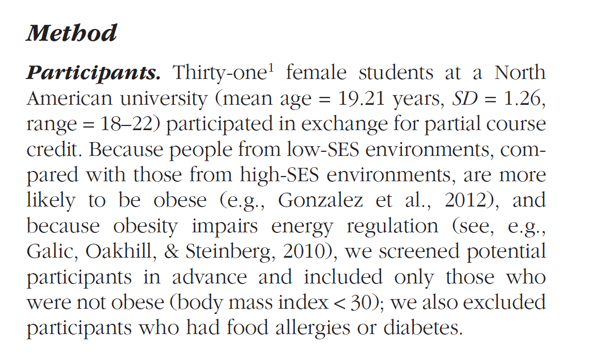
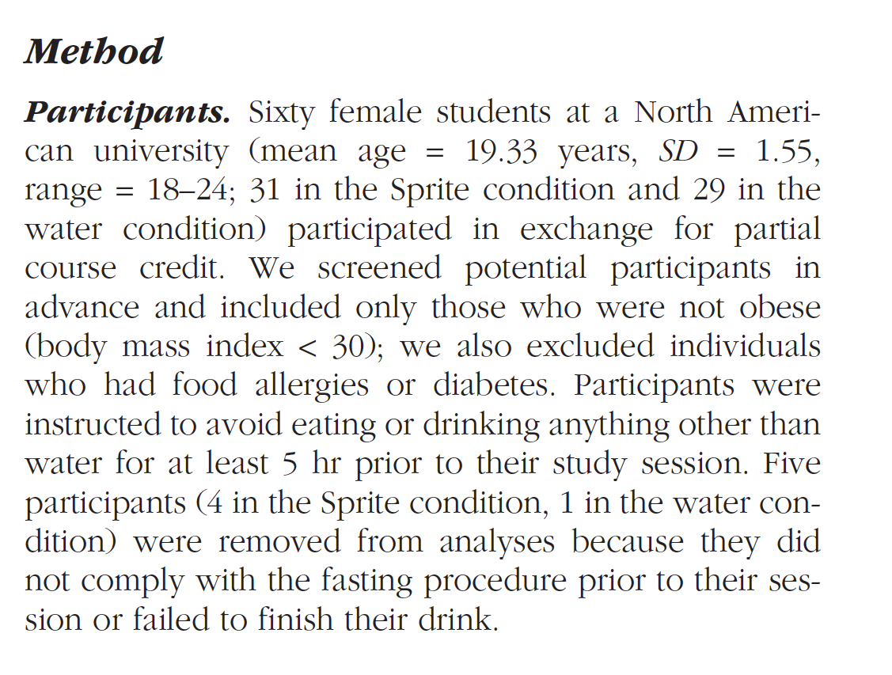
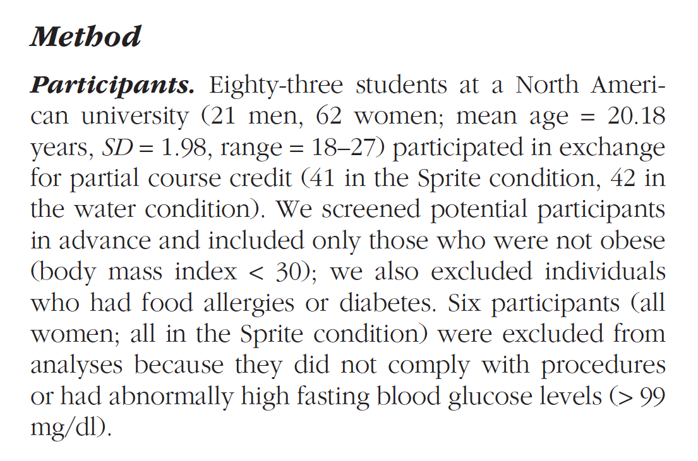
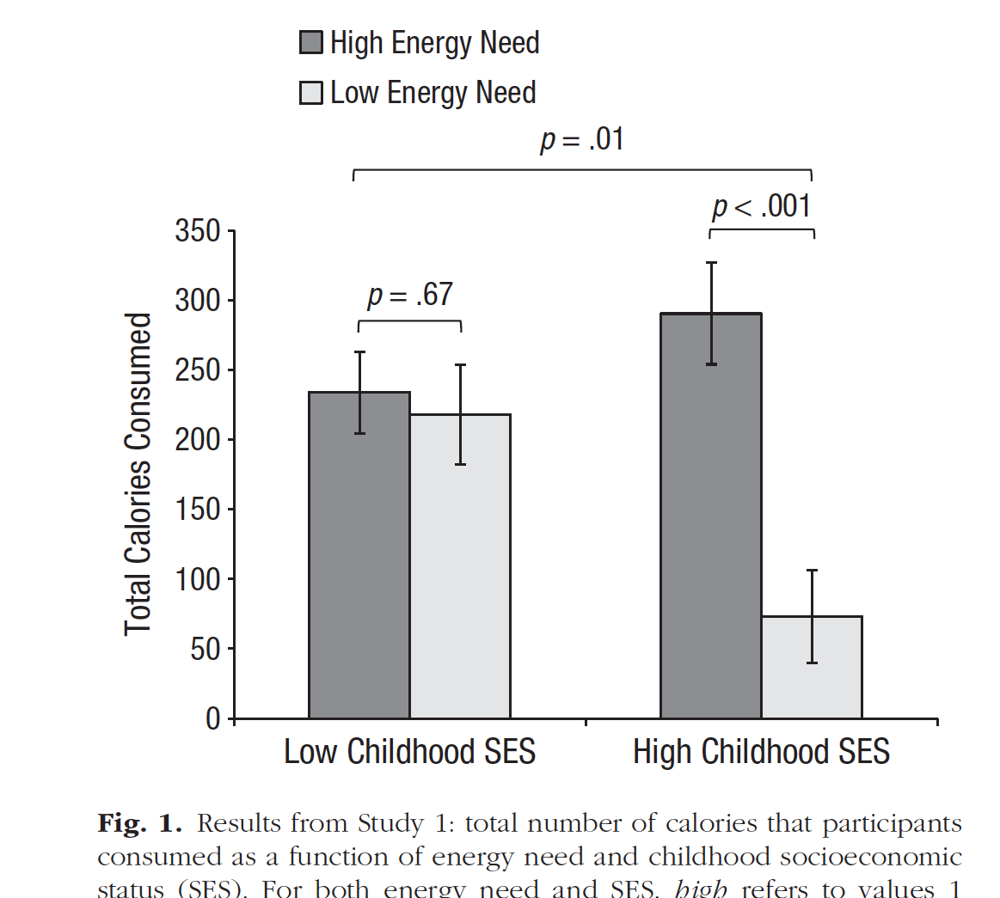
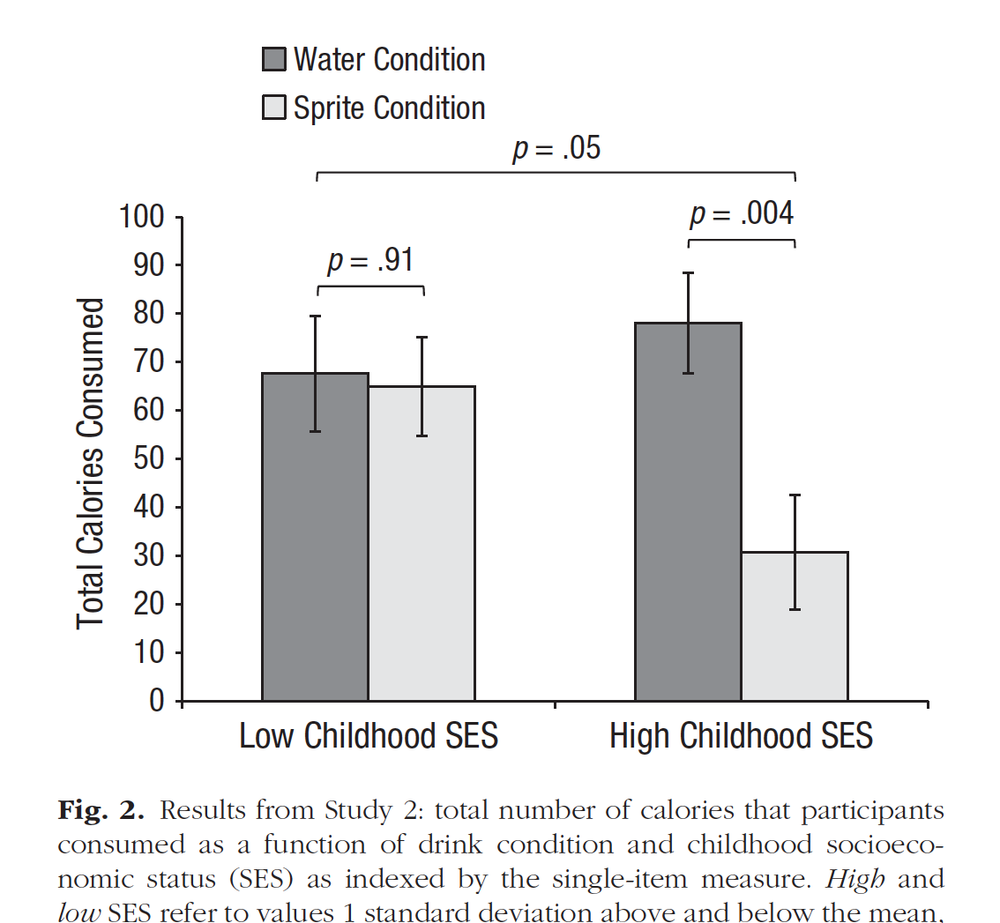
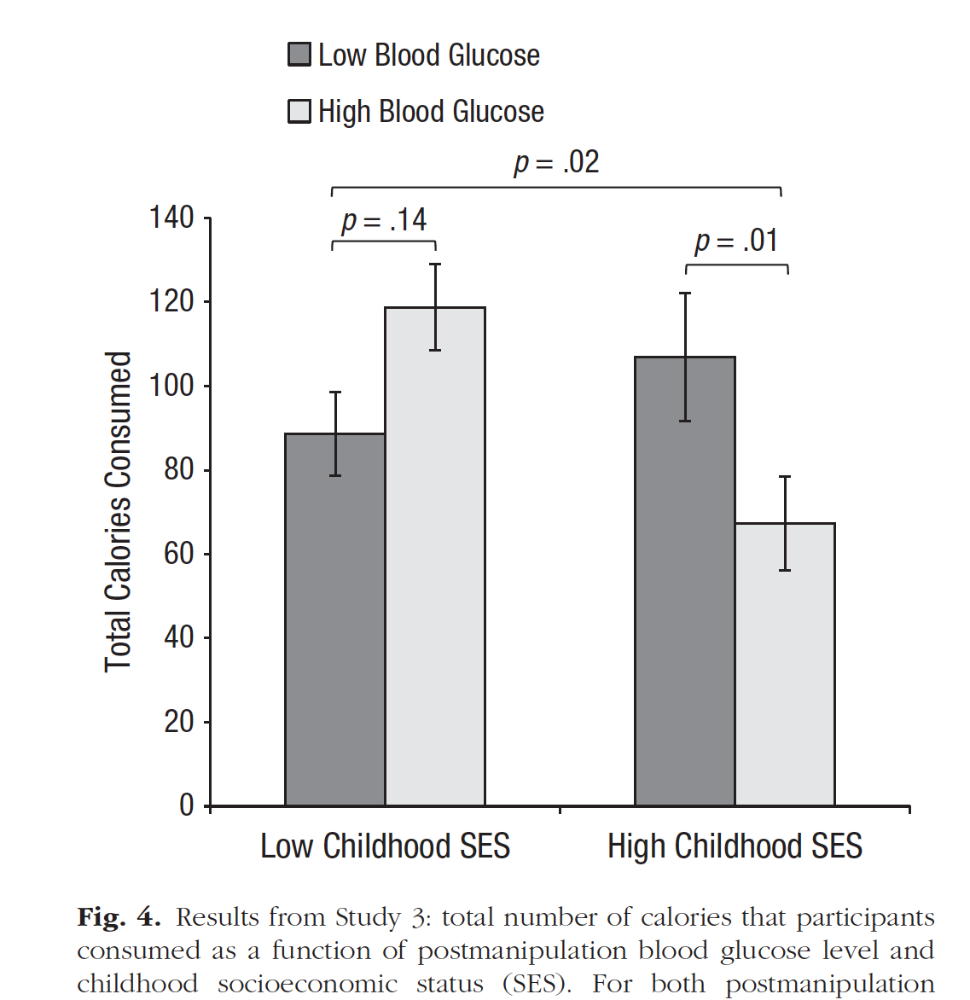
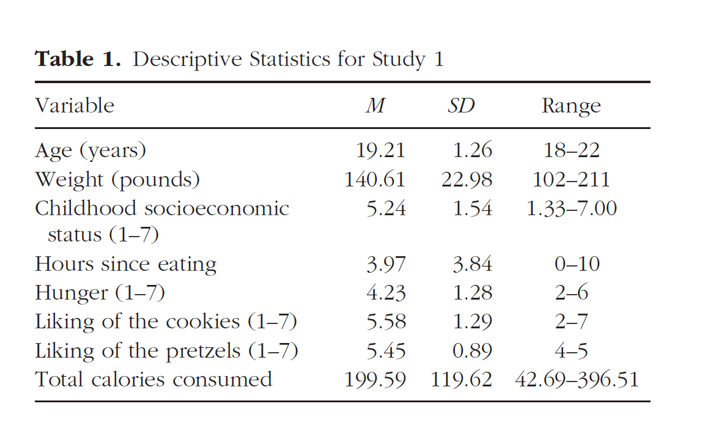
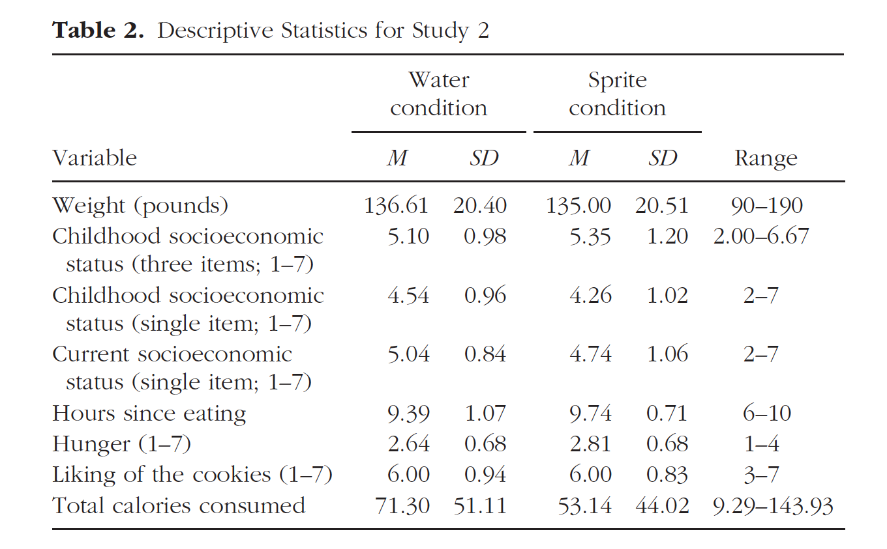
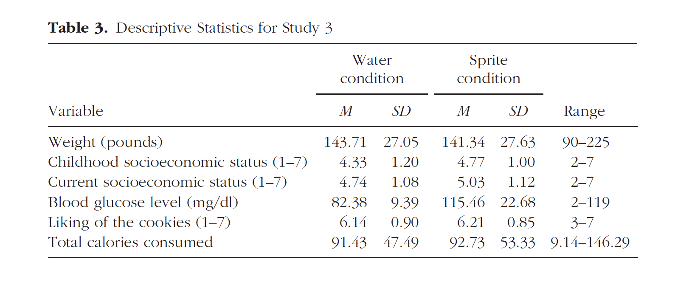

```{r setup, include=FALSE}
knitr::opts_chunk$set(echo = FALSE)
```

```{r include=FALSE}
library(tidyverse)

```

The paper we are planning to reproduce is...

[Hill, S. E., Prokosch, M. L., DelPriore, D. J., Griskevicius, V., & Kramer, A. (2016). Low childhood socioeconomic status
promotes eating in the absence of energy need. *Psychological Science, 27*, 354–364](https://pubmed.ncbi.nlm.nih.gov/26842316/).

The data is available to download from [this OSF repo](https://osf
.io/x8q4j/).

> NOTE: JennyS might use this data as an example in Q&A sessions, you can download the [csv file here](/data/eating_correlational.csv)


# Plan

There are 3 studies reported in this paper. For each study, the goal is to reproduce the ...

1. demographic descriptives (reported in Participants)
2. figures (column graphs reporting total calories as a function of SES and energy need/condition/glucose)
3. tables of descriptive statistics (M, SD, Range)

# Demographics

For each study the authors report...

- how many students participated
- mean, SD, range age

## Study 1

The goal is to reproduce the demographic descriptives in the Participants section here. 

```{r out.width = "50%"}

```


## Study 2

The goal is to reproduce the demographic descriptives in the Participants section here. 

```{r out.width = "50%"}

```

## Study 3

The goal is to reproduce the demographic descriptives in the Participants section here. 

```{r out.width = "50%"}

```


# Figures


## Study 1

The goal is to reproduce this column graph.

```{r out.width = "50%"}

```


## Study 2

The goal is to reproduce this column graph.

```{r out.width = "50%"}

```


## Study 3

The goal is to reproduce this column graph.

```{r out.width = "50%"}

```

# Tables

## Study 1

The goal is to reproduce the values and formatting in this table. 

```{r out.width = "50%"}

```

## Study 2

The goal is to reproduce the values and formatting in this table.

```{r out.width = "50%"}

```


## Study 3

The goal is to reproduce the values and formatting in this table.

```{r out.width = "50%"}

```


# First steps

To get started we need to...

- download the csv for each study from OSF
- locate a codebook (if there is one) to work out which variables contain demographic information
- work out how to count participants by gender/condition and calculate the mean, SD, and range of ages in each sample